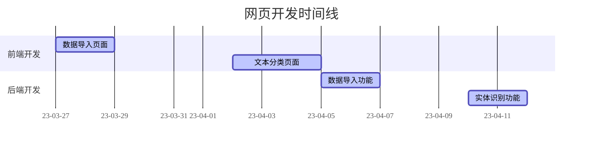

### 一.功能设计

##### 1.用户登录

​	登录成功->进入主页面

​	登录失败->显示提示信息

##### 2.医案导入

​	主页面->选择导入->选择文件（支持多个文件）->显示进度条->可删除部分文件->提交

​	->页面跳转,显示实体识别结果

##### 3.实体识别结果展示

​	高亮实体识别信息

##### 4.医案分类结果展示

​	圆点聚类图展示分类结果->点击一个圆点->展示文件内容

 

### 二.页面设计

 

### 附录

##### 前端运行

1. 进入到`frontend`目录
2. 输入`npm start`
3. 访问`localhost:3000`即可

##### 服务器运行

1. 进入到`backend`目录
2. 输入`flask run`命令
3. 访问`localhost:5000`即可

### 三、数据库设计

##### 原始中医医案（RawMedicalRecord)

| 属性名  | 属性含义 |    属性类型    | 主键 | 最大长度 |
| :-----: | :------: | :------------: | :--: | :------: |
|   id    |  医案ID  | FieldType.Text | yes  |          |
|  title  |  医案名  | FieldType.Text |      |    50    |
| author  |   作者   | FieldType.Text |      |    20    |
| content | 医案信息 | FieldType.Text |      |   5000   |

​	
